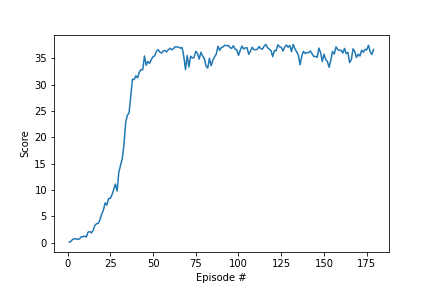

# Learning Algorithm

The methodology used to solve this problem is an actor-critic method called Deep Deterministic Policy Gradient (DDPG) and it was first implemented in [this](https://arxiv.org/abs/1509.02971) paper.

Since we have a continuous action space it is not possible to apply Q-learning, because it is too slow for unconstrained function approximators.

- **Critic:** The Critic model computes the Q values for any given state/action pair using the Bellman Equation.

- **Actor:** Current policy is estimated by mapping states to actions in a deterministic way. We then update the actor parameters by performing gradient ascent on the policy.

- **Replay Buffer:** The exploration policy is used to sample transitions from the environment and the combination of states, actions and rewards is stored in teh replay buffer. The old samples are discarded when the replay buffer becomes full. A minibatch is sampled uniformly from the buffer at each time step in order to update the critic and the actor. The **buffer size** that we use is **10,0000** and the **minibatch size 128**.

- **Soft Update:** DDPG uses soft target updates instead of directly copying the weights. The weights of the target networks (actor and critic) are gradually updated, which improves the stability of learning. The **tau** parameter that is used for the soft update is **0.001**.

- **Hyperparameters:** We use the same learning rates for the actor and critic (**0.0001**) networks. We set the **L2 weight decay** to **0** and the **discount factor gamma** to 0.99. The optimizer is an Adam optimizer

- **Networks:** The final output layer of the actor network is a _tanh_ layer, that is necessary to bound the actions. The low-dimensional networks had 2 hidden layers with **258** and **126** units respectively. The final layer weights and biases for the two networks were initialized from a uniform distribution **[-0.003, 0.003]**. This ensures that the initial outputs for the policy and value estimates are near zero. A **ReLU** activation is used for the fully connected layers of the two networks. The full architectures of the neural networks are:

  - Actor: Linear(33, 256) - ReLU - Linear(256, 128) - ReLU - Linear(128, 4)
  - Critic: Linear(33, 256) - ReLU - Linear(256+4, 128) - ReLU - Linear(128, 1)

- **Noise:** We add temporally correlated noise to encourage explanatory behaviour in the agent. In particular we used the Ornstein-Uhlenbenk process that models the velocity of a Brownian particle with friction. The parameters for this process are: **theta = 0.15** and **sigma = 0.2**

# Results

The environment was solved after 179 episodes with an average score of 30.03 over 100 episode windows.

The x-axis in this graph shows the incremental number of episodes. The y-axis shows the the average score for the last 100 episodes

## Future work

I would like to try other algorithms like [PPO](https://arxiv.org/pdf/1707.06347.pdf), [A3C](https://arxiv.org/pdf/1602.01783.pdf), and [D4PG](https://openreview.net/pdf?id=SyZipzbCb) that use multiple (non-interacting, parallel) copies of the same agent to distribute the task of gathering experience.

Finally it would be interesting to try various weight initializations and evaluate the difference in the results.
